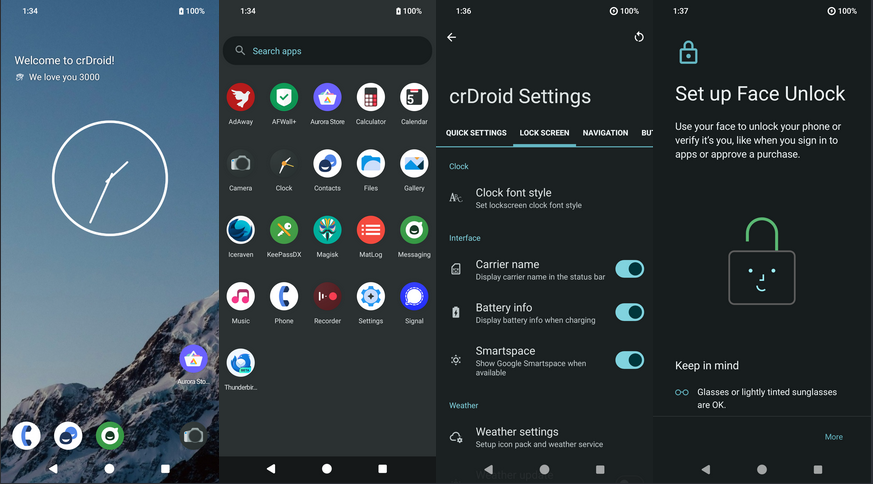
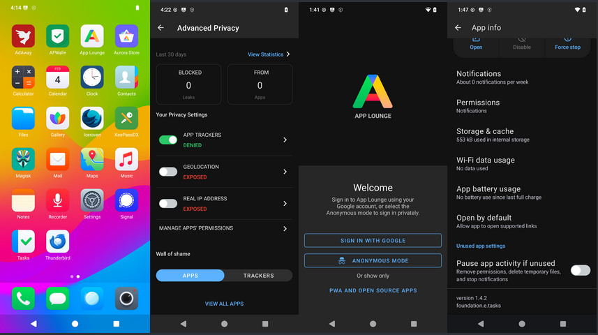
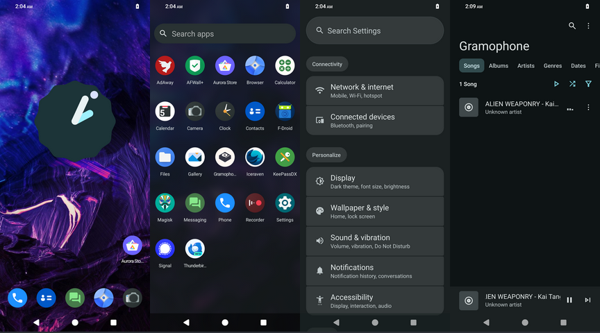
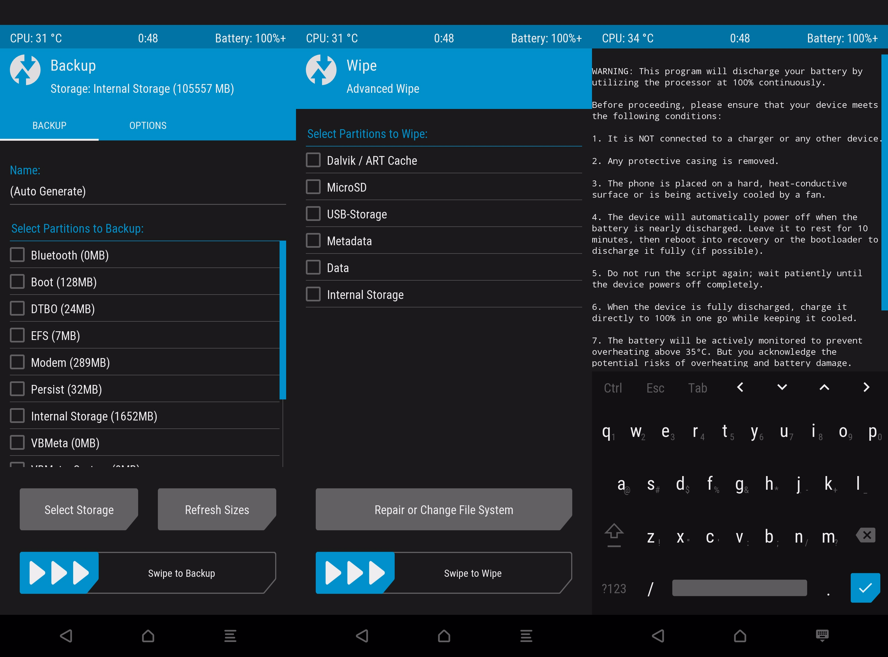
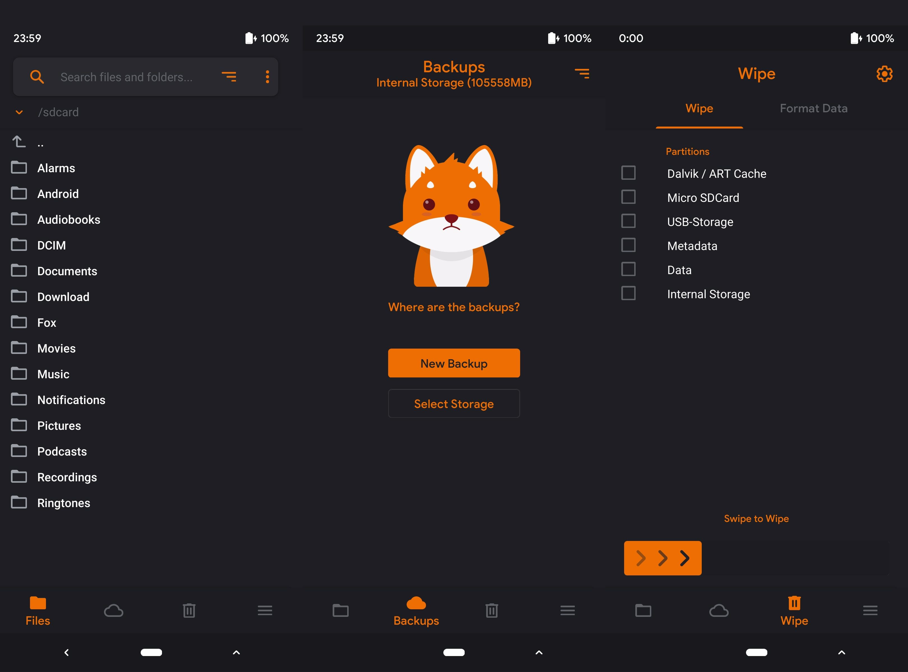
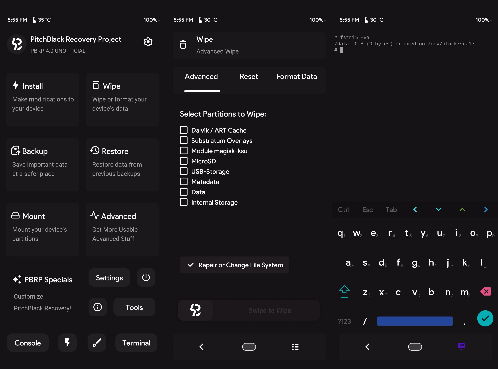

layout: page
title: Fortress64 - Securing Your Digital Privacy
subtitle: Latest Releases for Xiaomi Redmi Note 10, Samsung Galaxy Note 10.1 2014 and the Android Live Recovery USB
callouts: spes
---
layout: page
title: Fortress64 - Securing Your Digital Privacy
subtitle: Latest Releases for Xiaomi Redmi Note 10, Samsung Galaxy Note 10.1 2014 and the Android Live Recovery USB
callouts: n1awifi
---
layout: page
title: Fortress64 - Securing Your Digital Privacy
subtitle: Latest Releases for Xiaomi Redmi Note 10, Samsung Galaxy Note 10.1 2014 and the Android Live Recovery USB
callouts: rescue
---

Stay informed and protect your digital privacy with the best custom ROMs and recovery solutions available. 

# Software ROM Releases for the Xiaomi Redmi Note 10 (Sunny/Mojito)

Welcome to the ROM repository for the Xiaomi Redmi Note 10 (Sunny/Mojito). All releases listed here are compatible with Magisk, TWRP, PBRP, and OrangeFox recovery (not preloaded yet).

**Disclaimer**: Please follow these instructions carefully before seeking support. Flashing a custom ROM can lead to data loss, boot loops, or bricked devices if not done properly. By proceeding, you acknowledge that any issues arising from improper flashing are your responsibility.

---

## 1. 📱 ROM Releases

### 1.1 🌟 Key Features of CrDroid+ v11.6 | Android 15 | [XDA Thread](https://xdaforums.com/t/crdroid-v11-6-rom-unofficial-android-15-microg-ota-magisk-twrp-pbrp-orangefox-xiaomi-redmi-note-10-sunny-mojito-01-juli-2025.4717327/)

- 🔄 **OTA Updates:** Enjoy seamless over-the-air updates directly from our secure servers, ensuring your device is always up to date.
- ✅ **MicroG Verified Google Device:** This device has successfully passed Google Play Services' SafetyNet attestation, guaranteeing compatibility and security for a smooth user experience.
- ⚙️ **Custom Patchsets:** Benefit from tailored security and privacy patchsets designed to enhance both performance and user protection.
- 📝 **Edit Configuration:** Users can easily modify the **Fortress64/fortress64-apk.config.txt** file to customize the default user and system apps. This configuration file can be reused with every fresh installation, providing a personalized setup.

## 📦 Included Removable Apps

- 🔒 **AFWall:** Advanced firewall for enhanced security.
- 🛑 **AdAway:** Powerful ad-blocker.
- 📲 **Aurora Store:** An alternative to the Google Play Store that allows you to download apps anonymously.
- 💾 **Neo Backup:** Open-source tool to backup your apps and data.
- 🗝️ **KeePassDX:** A password manager for securely storing and managing your passwords.
- 🌍 **Ironfox:** Privacy-focused web browser.
- 📡 **MicroG:** Free and open-source implementation of Google Play Services.
- 🗺️ **Organic Maps:** Offline map application that respects your privacy.
- 🛡️ **WireGuard:** Cutting-edge VPN solution for a fast and secure internet connection.
- 📩 **Signal:** Encrypted messaging app.
- 📁 **Fossify File Manager:** Modern file manager prioritizing user privacy and customization.
- 🔐 **DroidFS:** User-friendly file system management tool for encrypting files for secure cloud storage.
- 🖥️ **Termux:** Terminal emulator and Linux environment for Android.
- 📬 **Thunderbird:** Free and open-source email client with robust features.
- 🔓 **Magisk:** Tool for rooting Android devices and managing root permissions.

---

---

### 1.2 🌟 Key Features of LineageOS+ v22.2 | Android 15 | [XDA Thread](https://xdaforums.com/t/lineageos-v22-2-rom-unofficial-android-15-microg-ota-magisk-twrp-pbrp-orangefox-xiaomi-redmi-note-10-sunny-mojito-01-juli-2025.4717332/)

- 🔄 **OTA Updates:** Enjoy seamless over-the-air updates directly from our secure servers, ensuring your device is always up to date.
- ✅ **MicroG Verified Google Device:** This device has mostly passed the SafetyNet attestation from Google Play Services, ensuring compatibility and security for a seamless user experience.
- ⚙️ **Custom Patchsets:** Benefit from tailored security and privacy patchsets designed to enhance both performance and user protection.
- 📝 **Edit Configuration:** Users can easily modify the **Fortress64/fortress64-apk.config.txt** file to customize the default user and system apps. This configuration file can be reused with every fresh installation, providing a personalized setup.

## 📦 Included Removable Apps

- 🔒 **AFWall:** Advanced firewall for enhanced security.
- 🛑 **AdAway:** Powerful ad-blocker.
- 📲 **Aurora Store:** An alternative to the Google Play Store that allows you to download apps anonymously.
- 💾 **Neo Backup:** Open-source tool to backup your apps and data.
- 🗝️ **KeePassDX:** A password manager for securely storing and managing your passwords.
- 🌍 **Ironfox:** Privacy-focused web browser.
- 📡 **MicroG:** Free and open-source implementation of Google Play Services.
- 🗺️ **Organic Maps:** Offline map application that respects your privacy.
- 🛡️ **WireGuard:** Cutting-edge VPN solution for a fast and secure internet connection.
- 📩 **Signal:** Encrypted messaging app.
- 📁 **Fossify File Manager:** Modern file manager prioritizing user privacy and customization.
- 🔐 **DroidFS:** User-friendly file system management tool for encrypting files for secure cloud storage.
- 🖥️ **Termux:** Terminal emulator and Linux environment for Android.
- 📬 **Thunderbird:** Free and open-source email client with robust features.
- 🔓 **Magisk:** Tool for rooting Android devices and managing root permissions.

---

---

### 1.3.🌟 Key Features of e/OS e-2.8-u | Android 14 | [XDA Thread](https://xdaforums.com/t/discontinued-e-os-e-2-8-u-rom-unofficial-android-14-ota-magisk-twrp-pbrp-orangefox-xiaomi-redmi-note-10-sunny-mojito-06-feb-2025.4717275/) | **DEVELOPMENT DISCONTINUED**

   - 🔧 OTA Updates: Receive seamless updates directly via over-the-air from our own secure servers (OTA).

📦 Included Apps (All Removable)​

   - 🔑 **Magisk** - Root management tool
   - 🛍️ **Aurora Store** - Privacy-respecting app store
   - 🔒 **AFWall** - Advanced firewall for enhanced security
   - 🚫 **AdAway** - Powerful ad-blocker
   - 🌐 **Iceraven** - Privacy-focused web browser
   - 🗝️ **KeePassDX** - Secure password manager
   - 💬 **Signal** - Encrypted messaging app
   - 📧 **Thunderbird** - Feature-rich email client

---

---

### 1.4.🌟 Key Features of LMODroid 6.0 | Android 14 | [XDA Thread](https://xdaforums.com/t/discontinued-lmodroid-v6-0-rom-unofficial-android-14-ota-magisk-twrp-pbrp-orangefox-xiaomi-redmi-note-10-sunny-mojito-06-feb-2025.4717140/) | **DEVELOPMENT DISCONTINUED**

   - 🔧 OTA Updates: Receive seamless updates directly via over-the-air from our own secure servers (OTA).

📦 Included Apps (All Removable)​

   - 🔑 **Magisk** - Root management tool
   - 🛍️ **Aurora Store** - Privacy-respecting app store
   - 🔒 **AFWall** - Advanced firewall for enhanced security
   - 🚫 **AdAway** - Powerful ad-blocker
   - 🌐 **Iceraven** - Privacy-focused web browser
   - 🗝️ **KeePassDX** - Secure password manager
   - 💬 **Signal** - Encrypted messaging app
   - 📧 **Thunderbird** - Feature-rich email client

---

---

## 2. 🔧 Recovery Options [XDA Thread](https://xdaforums.com/t/multiple-custom-recoveries-unofficial-xiaomi-redmi-note-10-sunny-mojito-twrp-orangefox-pbrp-02-juli-2025.4721961/)

---

   - **TWRP 3.7.1 (Team Win Recovery Project)**
   - 🖥️ Bootable Image
   - 📦 Installable ZIP
     

---

   - **OrangeFox 11.3 (Orange Fox Recovery Project)**
   - 🖥️ Bootable Image
   - 📦 Installable ZIP
     
     

---

   - **PBRP 4.0 (Pitch Black Recovery Project)**
   - 🖥️ Bootable Image
   - 📦 Installable ZIP
     
     

---

## 3. 🚀 First-Time Flashing Instructions for Xiaomi Redmi Note 10 (Sunny/Mojito)

**⚠ Disclaimer:** Flashing a custom ROM carries risks, including data loss, boot loops, or bricked devices. Follow these instructions carefully. By proceeding, you acknowledge that any issues arising from improper flashing are your responsibility.

---

## 📌 Preparation Steps

### 1. Backup Your Data
Before proceeding, create a complete backup of your device. Flashing for the first time will erase all data and restore factory defaults.

### 2. Download and Flash Stock Firmware
- Download the latest firmware ([V14.0.9.0.SKGMIXM](https://mifirm.net/download/12791)).
- Extract the downloaded firmware package.

### 3. Enter Fastboot Mode
1. Power off your device.
2. Hold **Volume Down + Power** simultaneously to enter Fastboot mode.

### 4. Connect and Flash Stock Firmware
1. Connect your device to a PC via USB-C.
2. Open a terminal or command prompt.
3. Navigate to the extracted firmware folder and run:
   - **Windows:** `flash_all.bat`
   - **Linux/macOS:** `flash_all.sh`

### 5. Verify and Boot
- Ensure the flashing process completes with a "Success" message.
- If it fails, repeat Step 4 or force reboot by holding the Power button.
- Wait for the **MIUI** setup screen to appear after a successful flash.
- **Complete the MIUI setup** until the home screen is fully loaded, thereby finishing the MIUI post-installation process.

---

## 🔧 Flashing a custom ROM for the first time

### 6. Flash Custom ROM
1. Download your desired ROM, its 'boot.img' and 'vendor_boot.img' files
2. Re-enter Fastboot mode (see Step 3).
3. Open a terminal or command prompt.
4. Flash the recovery image using:
   - `fastboot flash boot boot.img`
   - `fastboot flash vendor_boot vendor_boot.img`
   - `fastboot reboot recovery`
5. In recovery mode:
   - Navigate using **Volume buttons** and confirm with the **Power** button.
   - Select **Apply Update > Apply from ADB**.
6. Flash the ROM:
   - `adb sideload your_rom.zip`
7. Once flashing is complete, restart recovery when prompted.

### 7. Factory Reset, Boot and Updating ROM
1. **Perform a factory reset in the custom recovery:**
   - Navigate to **Factory Reset** and confirm the action twice.
2. **Reboot your device** to load the new ROM.
3. **Flashing or updating a ROM** can now be done using the Updater app, or by rebooting the device into recovery mode and flashing a new ZIP image.

---

## 🔓 Optional: Root Access & Custom Recovery

### 8. Install Magisk (Root) and/or Custom Recovery
1. Download **Magisk** from [GitHub](https://github.com/topjohnwu/Magisk) and/or the **TWRP (Team Win Recovery Project)**, **PBRP (Pitch Black Recovery Project)**, or  **OrangeFox Recovery** custom recovery from [this location](https://github.com/PTX64/releases_sunny_recoveries/releases/tag/latest).
2. **Disable your screen lock or set it to "swipe."** Otherwise, the custom recovery may be unable to decrypt your data partition.
3. Boot into recovery mode and install the custom recovery first (if required):
   - `adb sideload your_custom_recovery.zip`
4. Flash Magisk:
   - `adb sideload Magisk-version.apk`
   -  In TWRP and PBRP recovery, navigate to the /Magisk/Magisk.zip file and proceed to flash the zip. Additionally, OrangeFox features the latest Magisk support integrated directly into its user interface.
5. Reboot and complete Magisk setup in the app.

---

## 🏪 Play Store & Alternative App Stores

### 9. Aurora Store / MicroG / MindTheGapps / Play Store Support

1. **Default App Stores by ROM:**
   - **CrDroid:** Aurora Store / FDroid / MicroG
   - **LineageOS:** Aurora Store / FDroid / MicroG
   - **E/OS:** Aurora Store, App Lounge, MicroG
   - **LMODroid:** Aurora Store

2. **MindTheGapps Support:**
   - Please note that GApps support is not included by default. However, in most cases, you can rely on MicroG as an alternative.

3. **MindTheGapps Installation:**
   - Download for **CrDroid/LineageOS**: [ARM64](https://mindthegapps.com/#MindTheGapps-for-Android-15-LineageOS-22)
   - Download for **E/OS & LMODroid**: [ARM64](https://mindthegapps.com/#MindTheGapps-for-Android-14-LineageOS-21)
   - Flash the .zip files using the recovery mode.

---

## ⚠️ Common Issues & Fixes

### 1. Black Screen After Booting Custom Recovery
- **Cause:** The ROM uses `vendor_boot`, which can cause issues with custom recoveries.
- **Solution:** 
  1. Use a ROM that supports non-`vendor_boot` recoveries.
  2. Ensure you flash both the `boot` and `vendor_boot` images correctly.

### 2. Screen Hangs in Custom Recovery
- **Cause:** The recovery may not support encryption, or the data partition may be corrupted.

#### Action 1: Disable Screen Lock
- **Solution:** Disable your screen lock for better compatibility.

#### Action 2: Perform Factory Reset or Use a Compatible Recovery
- **Solution:** If the issue persists, perform a factory reset or switch to a recovery that supports decryption.

### 3. Touchscreen/Sideloading Not Working in Recovery
- **Cause:** An outdated ROM or firmware may have loaded old vendor firmware.
- **Solution:** Flash the latest ROM to update the vendor partition.

---

✅ **You're all set!** Enjoy your new custom ROM!

---

## 4.📝 Notes
1. Always use the latest firmware before flashing custom ROMs.
2. Follow the exact steps to avoid boot loops or bricked devices.
3. Utilize **ADB** and **Fastboot** tools for a seamless flashing experience.
4. A custom recovery and Magisk must be flashed after each update, as they are overwritten by the updating process.
5. Updates will be released monthly or quarterly, and unpopular ROMs with fewer than 10 users may be dropped eventually.
6. We welcome your opinions or corrections if they can help improve our work.
    
---

## 5. 🎉 Credits:​
A huge thanks to our dedicated small team of seasoned Linux/GNU enthusiasts and others who made this release possible for this device:

Credits:
Anush02198, alonsoj636MW, romgharti, Nebrassy, MPK99, Palatinux, PhilMCrackin' cyberknight777

Yes, we recognize that there are comparable ROMs available for this device. However, our versions are quite distinct and cater to a different audience. We appreciate your understanding regarding our approach to development and communication.

